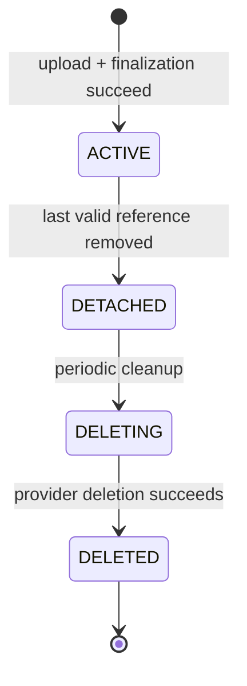

# Asset — Lifecycle

> **Status:** Draft (Target Architecture)
>
> **Version:** 1.0
>
> **Last Updated:** 2026-09-05

---

# Purpose

This document defines the states an Asset moves through from the moment it is finalized to the moment the underlying storage object is gone, the valid transitions between those states, and the failure paths that make the state machine trustworthy rather than aspirational.

Asset lifecycle begins only once an upload has actually produced an Asset. The upload attempt itself — authorizing it, performing it, waiting on the provider — happens before that point and is not part of Asset lifecycle at all. See [Upload Intent, Not an Asset State](#upload-intent-not-an-asset-state) below and [`upload.md`](./upload.md).

**Current Implementation:** The Prisma `Asset` model has no state/status field of any kind. Every Asset that exists today is implicitly and permanently in what this document calls `ACTIVE` — there is no way to represent "no longer referenced" or "being deleted," and there is no code path that deletes an Asset at all. Everything in this document describes the target the schema and application layer need to grow into, not what is implemented.

---

# The Four States

This is the complete V1 lifecycle. An Asset is created directly in `ACTIVE` — there is no intermediate Asset state for an upload in progress. It intentionally omits provider-deletion retry (the Asset simply remains `DELETING` and cleanup retries — see [Failure Paths](#failure-paths)) so the core lifecycle stays readable.

| State | Meaning |
|---|---|
| `ACTIVE` | Upload and finalization completed successfully. Normal, healthy, usable state. This is the state an Asset is created in. |
| `DETACHED` | No longer referenced by any entity. Still exists in storage; nothing about being detached implies the bytes are gone. |
| `DELETING` | The system has decided to physically remove the stored object and that removal is in progress. |
| `DELETED` | The deletion lifecycle has completed. |

---

# Upload Intent, Not an Asset State

Before an Asset exists, there is an **UploadIntent**: the short-lived, application-layer record of an authorized upload attempt (see [`upload.md`](./upload.md)). An UploadIntent is persisted, short-lived, immutable, single-use, and scoped to the actor and purpose that requested it.

`UPLOADING` is *not* an Asset lifecycle state. An in-progress upload belongs entirely to the UploadIntent / upload process. The Asset record itself is only ever created once, at the point an upload succeeds and finalization succeeds — directly in `ACTIVE`. There is no "Asset row that exists but isn't ready yet."

**Current Implementation:** There is no UploadIntent concept and no Asset state field of any kind. The current flow creates an `Asset` row only once the browser has already finished uploading to Cloudinary and the backend has persisted the result (see [`upload.md`](./upload.md)) — which already matches the target's "Asset is created directly in `ACTIVE`" behavior, even though nothing today marks that row as `ACTIVE` explicitly.

---

## ACTIVE

The Asset has completed upload and finalization and is the normal, healthy state. It can be attached to any number of the entity relations described in [`overview.md`](./overview.md#relationships-to-domain-entities) (subject to whatever cardinality that relation allows — most are "one active reference," galleries are many).

An Asset is created directly in `ACTIVE`. There is no prior Asset-level state it transitions from.

---

## DETACHED

An Asset becomes `DETACHED` when it is no longer referenced by anything that uses it — for example, a user replaces their avatar, or a competition banner is cleared.

`DETACHED` deliberately does **not** mean deleted. The object may still exist in the storage provider. Separating "no longer referenced" from "physically removed" lets the system:

- avoid deleting storage objects synchronously inside the same request that removed a reference (which would tie a user-facing request's latency and failure modes to a third-party API call),
- give a grace window before storage deletion actually happens, if a product decision later wants one,
- reconcile a batch of detached Assets on its own schedule rather than one at a time.

**`DETACHED` is terminal with respect to reuse.** A detached Asset cannot be reattached. If the same underlying file is needed again after detachment, that requires a new upload producing a new Asset — there is no `DETACHED → ACTIVE` transition.

**Current Implementation:** Every `Asset` relation in the schema uses `onDelete: SetNull`. In practice this means when, say, a user replaces their avatar, the *old* `Asset` row is simply left behind with no reference pointing at it and no marker that it is now orphaned — the equivalent of `DETACHED`, but invisible and untracked. Nothing currently identifies these rows, and nothing cleans them up or removes the corresponding Cloudinary object. This is an existing, live gap, not a hypothetical one.

---

## DELETING

The system has decided to physically remove the stored object, and that removal is in progress. This state exists so that provider deletion — an operation against a third-party API that can fail, time out, or be slow — is represented explicitly rather than assumed to be instantaneous or guaranteed to succeed.

In V1, an Asset only ever enters `DELETING` from `DETACHED`, via periodic cleanup. There is no normal `ACTIVE → DELETING` transition — physical deletion is never initiated while an Asset is still referenced. A future force-delete or moderation-driven removal of a still-referenced Asset is out of scope for V1 and is mentioned here only as a possible future direction, not as a current transition.

**Current Implementation:** No deletion code path exists anywhere in the codebase (verified — there is no call to Cloudinary's `destroy`/similar, no `AssetRepository.delete`, no admin or user-facing "delete asset" action). `DELETING` is entirely aspirational today.

---

## DELETED

The Asset has completed its deletion lifecycle: the storage object has been removed (or the deletion has been accepted as final by policy — see below).

**Open question — Decision: TBD.** Whether a `DELETED` Asset's database row is hard-deleted or retained (e.g. as a tombstone, for audit purposes, consistent with the soft-delete convention (`deletedAt`) already used elsewhere in the schema for major entities like `Competition` and `Project`) is not decided by this architecture. Both are compatible with the state machine described here; the choice is a product/implementation decision to make when this is built, not one this document makes on its behalf.

---

# Valid Transitions

| Transition | Trigger |
|---|---|
| `[*] → ACTIVE` | An UploadIntent's upload succeeds *and* the result is validated *and* the Asset record is finalized. The Asset is created directly in this state. |
| `ACTIVE → DETACHED` | The last entity reference to the Asset is removed. |
| `DETACHED → DELETING` | Periodic cleanup schedules a detached Asset for physical deletion (mechanism TBD — see [`security.md`](./security.md#orphan-and-cleanup-architecture)). |
| `DELETING → DELETED` | Provider deletion succeeds. |

No other transitions are valid in V1. In particular:

- There is no `DETACHED → ACTIVE` transition (no reattachment).
- There is no normal `ACTIVE → DELETING` transition (physical deletion only follows detachment).
- There is no `DELETING → DETACHED` transition (see [Failure Paths](#failure-paths) below).

---

# Failure Paths

The state machine only has teeth if every failure mode has a defined destination. This is where the target architecture must be explicit rather than convenient.

| Scenario | Behavior |
|---|---|
| **Provider upload fails, or the UploadIntent is abandoned** (client disappears mid-upload, tab closed, network dies) | No Asset is ever created — an UploadIntent that never resulted in a successful, validated upload has nothing to reconcile at the Asset level, because the Asset lifecycle never begins. Reconciling abandoned or expired UploadIntents is a concern of the upload process itself (see [`upload.md`](./upload.md)), not of Asset lifecycle. |
| **Storage succeeds, but Asset finalization fails** | This is the classic orphan case: a Cloudinary (or future provider) object now exists that Kizunia has no valid, finalized Asset record for — the Asset was never created, because finalization is what creates it. This is a reconciliation problem, not a lifecycle transition — see [`security.md`](./security.md#orphan-and-cleanup-architecture) for how it must be handled. **Current Implementation:** this exact failure mode already exists in the current code today — the browser uploads directly to Cloudinary and only *afterward* posts the result to the backend to persist an `Asset` row (see [`upload.md`](./upload.md)); if that second step fails, the Cloudinary object is already an orphan with nothing tracking it. |
| **Physical deletion from storage fails** | The Asset **remains `DELETING`**. It does not fall back to `DETACHED`. Cleanup/reconciliation retries the physical deletion from `DELETING` until it succeeds; a failed attempt is not treated as evidence the Asset should be reconsidered "merely detached" again. |
| **Can a `DETACHED` Asset be reattached?** | No. Reattachment is not supported. If the same underlying file is needed again, a new upload produces a new Asset. |
| **Can an `ACTIVE` Asset go directly to `DELETING`?** | No, not in V1. Physical deletion is only ever initiated after an Asset has become `DETACHED`. A future force-delete or moderation path for still-referenced Assets is out of scope for this document and would need its own design if pursued. |
| **Can a `DELETED` Asset become `ACTIVE` again?** | No. Once storage deletion has completed, there is nothing to reattach — the underlying object is gone. A new upload producing a new Asset is the only path back to something equivalent. |

---

# Lifecycle Invariants

- An Asset only ever comes into existence in `ACTIVE` — there is no partially-created, not-yet-usable Asset row.
- A `DETACHED`, `DELETING`, or `DELETED` Asset is never a valid target for a *new* attachment. Reuse after detachment always means a new upload, never reattachment of the existing record.
- Storage success and Asset-finalization success are two different facts. The lifecycle must never assume one implies the other — this is the core reason the orphan-reconciliation problem exists (see [`security.md`](./security.md)).
- Detachment (reference removal) and deletion (storage removal) are always separate operations, and physical deletion never runs ahead of detachment.

---

# Guiding Principle

> **The lifecycle exists so that "does this Asset still exist," "is it usable," and "is it safe to physically delete" are always three separately answerable questions — never one assumption standing in for all three.**
