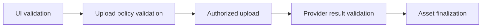
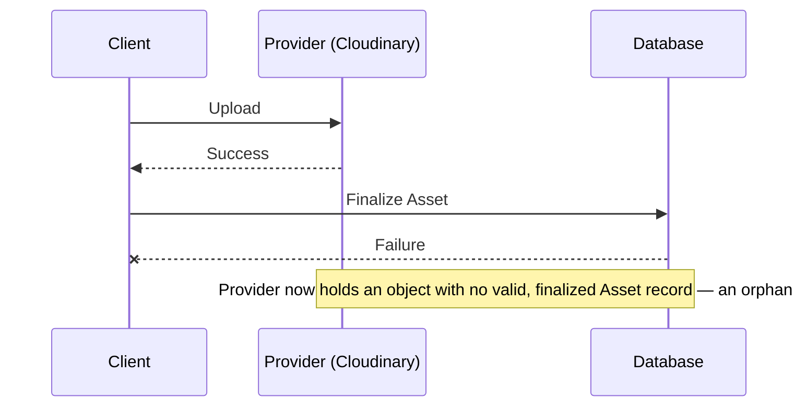

# Asset — Security and Abuse Prevention

> **Status:** Draft (Target Architecture)
>
> **Version:** 1.0
>
> **Last Updated:** 2026-09-05

---

# Purpose

The Asset system must protect against upload spam, oversized uploads, unauthorized uploads and deletions, malicious files, orphaned storage objects, abuse of signed upload credentials, and provider quota exhaustion. This document defines what that means at each layer, and is explicit about which of these protections exist today and which do not.

---

# Authentication

Only authenticated actors should be able to perform protected uploads.

**Current Implementation:** `POST /api/cloudinary-sign` calls `auth.api.getSession(...)` (Better Auth) and throws `UnauthorizedError` if there is no session. This part matches the target and should be preserved.

---

# Authorization

The actor must be authorized to upload an asset for the *intended purpose and entity* — not merely logged in.

**Current Implementation:** The signing endpoint only checks that a session exists. It has no idea which entity the upload is for, so it cannot check "is this user a maintainer of this project / organizer of this competition." Authorization for *attaching* an asset presumably happens wherever `SetCompetitionAssetController` (or equivalent) is invoked from a route, but that is downstream of the point where a Cloudinary signature has already been issued — meaning **an authenticated user who is not authorized to edit a given competition can still obtain a valid, working Cloudinary upload signature** through this endpoint, even if they could not ultimately attach the result to that competition. Closing this requires the signing/authorization step itself to be scoped to a purpose and entity, per [`upload.md`](./upload.md), and to run Kizunia's existing authorization checks (see `docs/architecture/authorization/`) *before* issuing anything to the client.

---

# Rate Limiting

Upload attempts should be rate limited. Kizunia does not need new infrastructure for this — a fixed-window, Postgres-backed rate limiter already exists (`next/src/lib/rate-limit/index.ts`, backed by the `RateLimit` Prisma model) and is already used elsewhere in the codebase (`modules/taxonomy`, `modules/locations`).

**Current Implementation:** This limiter is **not applied** to `/api/cloudinary-sign` or to any Asset-creation endpoint today. Nothing currently stops an authenticated user from requesting an unbounded number of signatures or creating an unbounded number of `Asset` rows. The target architecture should apply the existing `checkRateLimit` utility, scoped per actor and per upload purpose, to the upload-intent step — this is an application of existing infrastructure, not new infrastructure.

---

# Quotas and Limits

Policies (see [`policies.md`](./policies.md)) should be able to express file size, count, and frequency limits, and potentially aggregate usage limits (e.g. total storage per user). **Decision: TBD** on exact numeric values and on whether aggregate/account-level quotas are needed at all — nothing in the repository or product requirements establishes these today.

---

# Short-Lived, Scoped Authorization

Any upload authorization or signature issued to the client should be short-lived and scoped to the specific upload it was issued for.

**Current Implementation:** Cloudinary signatures are implicitly time-bounded by the `timestamp` parameter Cloudinary itself validates (Cloudinary rejects signed requests once its timestamp is too old), so there is some time-boxing today, inherited from Cloudinary's own behavior rather than designed by Kizunia. There is **no scoping**, however: the signed parameters are whatever the client's `paramsToSign` object contains (`{ timestamp, folder }` in the current hook), and nothing restricts which folder, resource type, or transformation the client could ask to have signed. The target requires that whatever is authorized only be usable for the one upload it was issued for — an intended `PROJECT_LOGO` upload for a specific project, not "any Cloudinary upload."

---

# Provider Credentials

Provider secrets must never reach the browser.

**Current Implementation:** `CLOUDINARY_API_SECRET` is only read server-side (`next/src/app/api/cloudinary-sign/route.ts`), which is correct. `CLOUDINARY_API_KEY` / `NEXT_PUBLIC_CLOUDINARY_API_KEY` and `NEXT_PUBLIC_CLOUDINARY_CLOUD_NAME` are exposed to the client — this is consistent with Cloudinary's own signing model, where the API key identifies the account but is not itself a secret capable of authorizing anything without a valid signature. This does not need to change for Cloudinary specifically, but a future provider adapter must be evaluated against its own credential model rather than assumed to work the same way.

---

# Client-Side Checks Are UX Only

Client-side file-type/size checks (the `accept` prop on `ReusableImageUploader`, any size check before cropping) exist to give the user immediate feedback. They must never be treated as enforcement — see [`policies.md`](./policies.md#frontend-vs-backend-enforcement).

**Current Implementation:** Today, client-side checks are effectively the *only* checks — nothing server-side re-validates a submitted upload's type, size, or dimensions against any rule. `CreateAssetSchema` validates shape (an int is an int, a URL is a URL), not policy compliance.

---

# File Validation — Do Not Trust Client Metadata

The backend must not trust client-reported filename, browser-supplied MIME type, extension alone, client-provided size, or arbitrary provider parameters supplied by the client. The provider's *actual* result — and, where appropriate, the file's actual content — must be validated.

**Current Implementation:** This is the most significant current gap. `CreateAssetSchema` accepts `publicId`, `secureUrl`, `format`, `mimeType`, `width`, `height`, `bytes`, `checksum`, and `originalFilename` directly from the client's request body, with no re-verification against Cloudinary or against any policy (see [`upload.md`](./upload.md#current-implementation)). A client controls every one of these values as persisted in the database today.

For document types such as PDFs (and any future DOCX support), the same principle extends to content safety: **a storage provider successfully accepting and hosting a file does not make that file safe.** Malware/virus scanning for document uploads is a security requirement of the target architecture, not something Cloudinary or any provider provides automatically. **No such scanning exists in the repository today**, and none is assumed by this document to exist implicitly — it must be designed and added when document uploads are implemented.

---

# Layered Validation

Each layer catches what the previous layer cannot be trusted to have caught. UI validation is convenience; policy validation is the actual authorization boundary; provider result validation confirms the provider did what was authorized, nothing more; finalization is the only point at which an Asset becomes `ACTIVE`. See [`lifecycle.md`](./lifecycle.md) and [`upload.md`](./upload.md).

---

# Orphan and Cleanup Architecture

**Storage success does not imply Asset success.**

This is a **reconciliation problem**, distinct from ordinary error handling: by the time the failure is visible, the side effect that needs to be undone (or accounted for) is sitting in a third-party system, not in Kizunia's own database where a transaction rollback would erase it.

**Current Implementation:** This exact scenario is already possible today. The browser uploads directly to Cloudinary and only afterward posts the result to a Kizunia endpoint to persist an `Asset` row; if that second step fails for any reason, the Cloudinary object is already orphaned with nothing in the system aware of it. There is no reconciliation job, cron infrastructure, or queue of any kind in the repository today (verified — no scheduled-job or worker infrastructure was found).

Likewise, `DETACHED → DELETING → provider deletion` (see [`lifecycle.md`](./lifecycle.md)) are separate concerns: detaching a reference should not have to succeed or fail together with the (potentially slow, potentially failing) act of deleting the underlying storage object.

The target architecture requires that both of these be treated as first-class reconciliation problems:

- an upload that succeeded in storage but never became a finalized `Asset` must eventually be found and either finalized or cleaned up,
- an Asset that became `DETACHED` must eventually be picked up for `DELETING`.

**Decision: TBD** on the concrete mechanism (a scheduled job, a queue, a periodic reconciliation script) — no such infrastructure exists in this repository today, so none is assumed. What this document establishes is the *requirement* that such reconciliation exist, not its implementation.

---

# Deletion Authorization

Users and other domain actors do not directly delete Asset records, and no one directly transitions an Asset into `DELETING`. What actors authorize is the **domain operation** that adds or removes an Asset *reference* — replacing an avatar, clearing a competition banner, removing a gallery image. That operation is authorized the same way any other write to that entity is (Kizunia's existing authorization system — see `docs/architecture/authorization/`), because it is fundamentally an edit to the entity, not an Asset-level permission.

Once an Asset becomes `DETACHED` as a result of that operation, moving it onward to `DELETING` and physically removing it from storage is performed by trusted cleanup/reconciliation (see [Orphan and Cleanup Architecture](#orphan-and-cleanup-architecture)) — not by the user who happened to trigger the detachment, and not by any other end-user action. There is no user-facing or admin-facing "delete this Asset" operation in V1.

**Current Implementation:** There is no deletion code path of any kind in the repository (verified: no calls to a Cloudinary destroy/removal API, no `AssetRepository.delete`, no admin or user-facing delete-asset action anywhere). This needs to be designed alongside the deletion lifecycle in [`lifecycle.md`](./lifecycle.md) as trusted, system-initiated cleanup — not as a new user-facing permission.

---

# Denial of Arbitrary Provider Operations

The Storage Provider Contract (see [`storage.md`](./storage.md)) should expose only the specific operations the Asset system needs (authorize/upload, confirm, delete, generate delivery info) — never a general-purpose passthrough to the provider's full API. The current signing endpoint's "sign whatever parameters you send me" shape is exactly the pattern to avoid; the target's Upload Intent model (see [`upload.md`](./upload.md)) replaces it with authorization scoped to one declared, policy-validated upload.

---

# Observability

At minimum, the target architecture should make it possible to answer: who initiated an upload, for what purpose, whether it completed, whether it became orphaned, and whether deletion succeeded or failed. This should integrate with Kizunia's existing audit/error conventions (`lib/errors/`) rather than introducing a separate logging model. **Current Implementation:** no upload-specific observability exists today beyond what generic error handling and toast notifications on the client provide.

---

# Guiding Principle

> **The backend is the only party ever trusted to say what was uploaded, by whom, for what purpose, and whether it is safe. Everything the client says about its own upload is a claim to be verified, not a fact to be persisted.**
